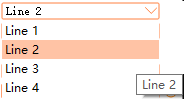
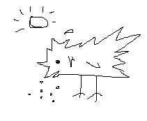
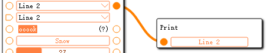
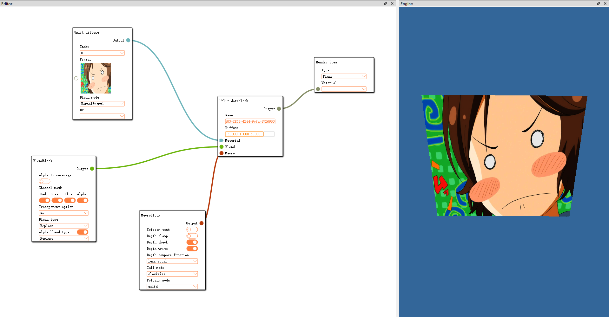
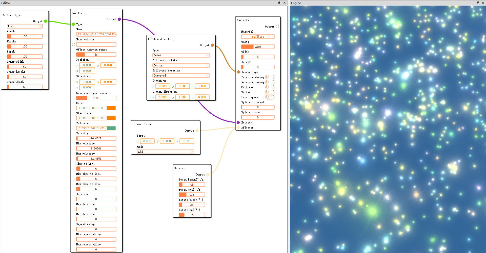
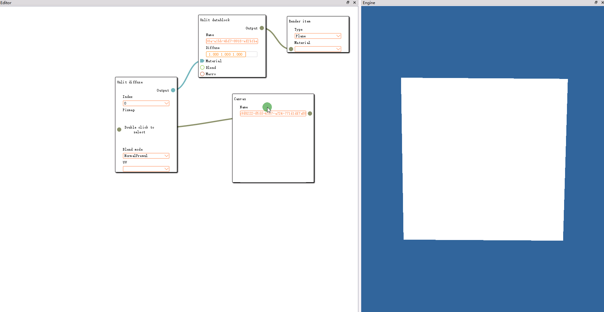

## Explanation
&emsp;&emsp;***OgreBlueprintKalami*** try to implement a node editor using QGraphics(a Qt module), aim to help guys to use this tool for material and particle editing. There are currently two branches:***master*** and ***8-6***，The ***master*** is expected to make merge submissions only in July; ***8-6*** is a branch that is usually used for development, it may be unstable.

PS: ***Kalami*** is a dialect that sounds like 'Color me', roughly meaning small, inconsequential.

### Talent show

&emsp;&emsp;In this project, each node is treated as a ***Card***, and each card is made up of multiple cells. ***Cell*** can be thought of as a row, and it is filled with ***Unit***, yes, a unit can be thought of as the smallest object of control that can be seen, it is the base class for inner controls. Now, we have the following controls.

1. Checkbox


2. ColorSelector(Ex)


3. ComboBox



4. Label


5. LineEdit


6. Pixmap


7. PushButton


8. SliderBar


9. VectorEditor


10. Canvas(Only pen)



&emsp;&emsp;The controls shown above are encapsulated in the ***BlueprintKernel***, in order to be reusaable and simple separation of Qt and ogre, in this way, the style of the controls doesn't need to be too much of a concern when using Kalami, the interfaces of the controls are also relatively clean. We can combine these controls as we want, and choose whether to add an anchor to connect other cards, ***Anchor*** is the endpoint of the cell, different cards can be connected by the same type of anchor. 



So... 

Unit project


Particle project


Realtime texture update(use QPainter)


### Ready and build

&emsp;&emsp;The whole project has added ***ogre-next*** and ***ogre-next-deps*** as submodules, and updated the external CmakeLists. Recursive updates can be made using the following command:

``` bash 
git submodule update --progress --init --recursive -- "ogre-next-deps"
git submodule update --progress --init --recursive -- "ogre-next"
```

About other dependences, it only need Qt above 5.12(I'm using this version, maybe a slightly lower version is fine, and I don't feel like I'm using any special methods). ohhh, C++ needs to support c++14. In addition, guys need to pay attention to the followings before compiling:

1. Note that when compiling ***OgreSceneFormat***, you need to add an entry for CmakeLists(ogre-next/Components/SceneFormat/CMakeLists.txt)

``` shell
[line 25] include_directories(${CMAKE_SOURCE_DIR}/ogre-next/Components/Hlms/Common/include)
```
2. When using Windows + msvc to compile, line 119 of **OgreIrradianceField.cpp** will report an error because the remark has exponential(maybe...), and the simple and crude way is to delete it

3.  When using Linux(Ununtu 22.04) to compile, I used VMware and Vulkan for validation and it needs to be changed a little at ogre-next/RenderSystems/Vulkan/src/Windowing/X11/OgreVulkanXcbWindow.cpp

``` c++
void VulkanXcbWindow::createWindow( const String &windowName, uint32 width, uint32 height, const NameValuePairList *miscParams )
    {
        uint32_t value_mask, value_list[32];
        value_mask = XCB_CW_BACK_PIXEL | XCB_CW_EVENT_MASK;
        value_list[0] = mScreen->black_pixel;
        value_list[1] = /*XCB_EVENT_MASK_KEY_PRESS |*/ XCB_EVENT_MASK_STRUCTURE_NOTIFY;

        if(miscParams)
        {
             NameValuePairList::const_iterator opt = miscParams->find("externalWindowHandle");
             if( opt != miscParams->end() )
             {
                 mXcbWindow = StringConverter::parseUnsignedInt(opt->second, 0);
             }
        }

        if(mXcbWindow == 0)
        {
            mXcbWindow = xcb_generate_id( mConnection );
        }

        xcb_create_window( ...
```
That is, add additional parameter parsing ***externalWindowHandle***, but at present, such a correction will report an error when the program exits (but does not affect the general logic), so there is no pull request to tribe(ogre's tribe)

### Usage
&emsp;&emsp;When I first thought about what the interface should look like, I preferred to be able to call it continuously, and it would be better to omit some intermediate variable declarations, as a result, most of the control's settings function returns its own pointer. Guys can write boldly like ***PrintCard.cpp***

``` c++
_pack({
    BKCreator::create(BKAnchor::AnchorType::Input)
        ->append( BKCreator::create<BKLineEdit>()
            ->setText("Uhhhhhh")
            ->setDataChangeCallback([](BKUnit* unit, const QVariant& data) ->bool {
                    if (!data.isValid()) {
                        dynamic_cast<BKLineEdit*>(unit)->setText("");
                    }
                    
                    return true;
                })
        )
    });
```

Or write conservatively, like***ReadFileCard***(Damn, it's really hard to find)
``` c++
    BKCell* outputCell = BKCreator::create(BKAnchor::AnchorType::Output);
    outputCell->setDataType(BKAnchor::Output, BKAnchor::String);
    mpOutputAnchor = outputCell->getAnchor(BKAnchor::AnchorType::Output);
    mpOutputAnchor->redirectToCard();
    BKLabel* outputLabel = BKCreator::create<BKLabel>();
    outputLabel->setAlignment(Qt::AlignVCenter | Qt::AlignRight);
    outputLabel->setText("Output");
    outputLabel->setMinWidth(160);
    outputCell->append(outputLabel, false);

    BKCell* watcherCell = BKCreator::create(BKAnchor::AnchorType::None);
    BKLabel* watcherLabel = BKCreator::create<BKLabel>();
    watcherLabel->setText("Auto listening");
    watcherCell->append(watcherLabel, false);
    BKCheckBox* watcherCheckBox = BKCreator::create<BKCheckBox>();
    watcherCheckBox->setChecked(false);
    watcherCheckBox->setDataChangeCallback(std::bind(&ReadFileCard::updateWatcherStatus, this, std::placeholders::_1, std::placeholders::_2));
    watcherCell->append(watcherCheckBox);

    ...

    _pack({
        outputCell,
        watcherCell,
        ...
        });
```

If the guys can understand anchor, unit, cell and card, I think creating own cards is not a hard thing. The controls in ***TestCard*** are still relatively comprehensive.

### Have to declare

1. Mistakes can occur in this project, such as Pbs materials, I can seem to feel it QAQ

2. There are some features that are not yet perfect, such as Simple Material. The initial expectation was that the shader would be dynamically updated and continued to be displayed even if there was an error, but for now it will quit due to an exception. I've turned to tribe for help, but I haven't figured out how to make it happen yet[How to know in advance whether a vertex program can be compiled or not](https://forums.ogre3d.org/viewtopic.php?t=97251)

3. Forgive me for my ugly project and English skills, I know neither of them is very good

4. If guys find a mistake in the project, please let me know. Although my ability is limited, I will try my best to understand and solve it.

5. I hope you all have fun

### Remark
1. If the switch of **INCLUDE_INNER_PARTICLE_CARD** has been changed, remember to clear CMakeCache.txt

### Key nodes
<table width="95%" cellpadding="2" cellspacing="1">
    <thead>
        <tr>
            <th></th>
            <th>Time</th>
            <th>Event</th>
            <th>Remark</th>
        </tr>
    </thead>
    <tbody>
        <tr>
            <td>1</td>
            <td>2024-03-12</td>
            <td>Make first git commit</td>
            <td><p>1. The card creation and card deletion have been preliminarily completed<br>2. The addition and deletion of connecting lines has been preliminarily completed<br>3. The Label is available</p></td>
        </tr>
        <tr>
            <td>2</td>
            <td>2024-03-17</td>
            <td>Implement controls</td>
            <td><p>1. The ComboBox is available<br>2. The PushButton is available<br><font color="#FF8000"><del>Tried to use QGraphicsProxyWidget to implement functions, but it seems to be a bit stuck...</del><br>It's a bit of a misunderstanding, It's OK in release mode. orz</font></p></td>
        </tr>
        <tr>
            <td>3</td>
            <td>2024-03-24</td>
            <td>Implement controls and transfer data between different cards</td>
            <td><p>1. The CheckBox is available<br>2. The LineEdit is available<br>3. The Spacer is available<br>4. Data can be transferred from one card to another<br><font color="#FF8000">*I was going to do Undo/Redo, but it failed<br>*When the data is connected, I sigh again that Qt is handsome~<br><del>*After the anchor is connected, the subsequent units will not be automatically updated. But I don't want the previous unit to be actively triggered, because I'm not sure how many units there are in the previous cell (although theoretically there is only one)...</del></font></p></td>
        </tr>
        <tr>
            <td>4</td>
            <td>2024-04-04</td>
            <td>There is another protagonist invited(ogre), applaud(ohhhhhh</td>
            <td><p>1. Import ogre-next、ogre-next-dep<br>2. An update is automatically triggered after the conection finished is corrected</p></td>
        </tr>
        <tr>
            <td>5</td>
            <td>2024-04-14</td>
            <td>The control function has been upgraded, and the PBS card has been initially split</td>
            <td><p>1. Input anchors can be connected by multiple output anchors, but only if the output anchor is bound to a card<br>2. Implement PBS cards little by little<br>3. Custom data types can be registered and recognized, and the colors can be randomized(Wouldn't it be nice to change the color every day?<br>PS: At this point, the control section is still short of the following<br>&emsp;1. Cards support shrinking<br>&emsp;2. A control that can support input vectors（Vec3f）</p></td>
        </tr>
        <tr>
            <td>6</td>
            <td>2024-05-12</td>
            <td>Submit an extensible cell</td>
            <td><p>1. This time the control part is really over (although there is no card shrinking yet), and the new expandable cell can dynamically change the number of members in the cell via the +/- button<br>PS: In fact, this time the key node record should be pushed up on May Day.On May Day, I'm ready to start Material-related.And then I saw the script parsing module,I really want to lie on the ground right now...I've been struggling with whether it would be better to use the way of calling scripts to parse, so that the import and export effects are the same. However, in the end, I chose to modify the class member variables directly or through interface.<br>The next step will be to work on the Material part, the extensible cell is mainly to implement the dynamic expand, and now that the control is pushed, it is natural to move on</p></td>
        </tr>
        <tr>
            <td>7</td>
            <td>2024-6-27</td>
            <td>Prepare for the first push</td>
            <td><p>1. Material didn't work: First of all, only a small series of Material cards were implemented, and secondly, it was not possible to enter half of the shader to ensure that the program could run normally, which was still a little worse than expected...<br>2. The cards related to particle effects are almost done, and they have been submitted√<br>3. Complementing canvas controls and custom material painting, my TinySeed is pretty much based on this and 'everything can be Painter in Qt'(This is my last ripple, JOJO)<br>4. Prepare to organize the project code, puuuuuuuuuuush!<br>By the way, the callback of the card was changed by me, and I'm so sorry... orz</p></td>
        </tr>
    </tbody>
</table>

Thanks to Bing for the translation
